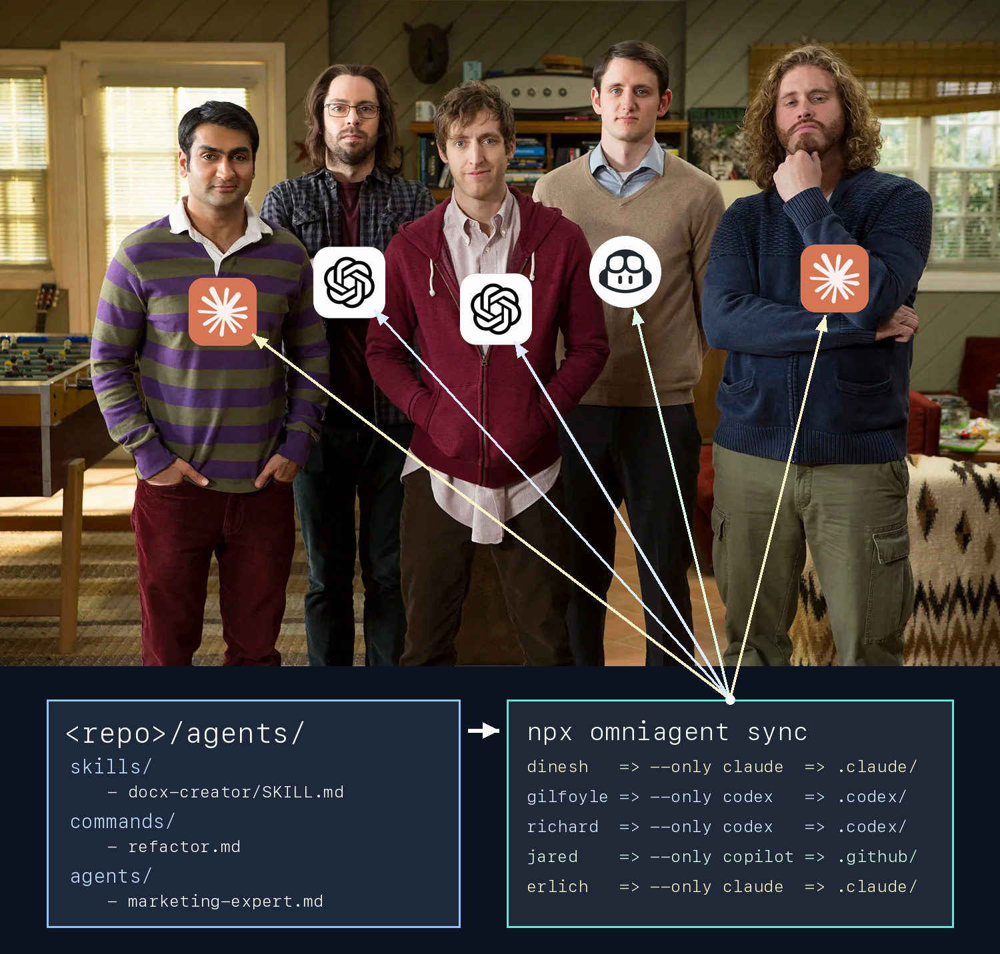

# omniagent

One source of truth for agent config across Claude, Codex, Gemini, and Copilot (and [any other agent](docs/custom-targets.md))

Define canonical agent files once in `agents/`, then run `sync` to compile target-specific outputs.

- Teams can keep one shared agent configuration while each teammate uses their preferred CLI.
- Agent enthusiasts can try out the newest agents, and switch back, without manually porting all their config.



## Quickstart

Author once in `agents/`, sync everywhere.

Subagents example:

```md
# ./agents/agents/release-helper.md

---

name: release-helper
description: "Help draft release plans and checklists."

---

Draft a release plan with milestones and owners.
```

Codex does not support subagents. Omniagent
converts the canonical file into Codex's skill format (and the equivalent format for other
supported CLIs).

After `sync`, outputs include:

```text
.claude/
  agents/
    release-helper.md
.codex/
  skills/
    release-helper/
      SKILL.md
```

## How It Works

1. Author canonical sources in `agents/` (and optional repo `AGENTS.md`).
2. Run `omniagent sync`.
3. Omniagent writes target-specific files, converting unsupported surfaces when needed.

## Common Commands

```bash
# Sync all supported agent CLIs installed on your system
npx omniagent@latest sync

# Sync specific targets
npx omniagent@latest sync --only claude,codex

# Skip a target for this run
npx omniagent@latest sync --skip codex

# Use a non-default agents directory
npx omniagent@latest sync --agentsDir ./my-custom-agents

# Show local-only overrides and exit
npx omniagent@latest sync --list-local

# Shim mode (no subcommand)
omniagent --agent codex
omniagent -p "Summarize this repo" --agent codex --output json
```

## Local Overrides (`.local`)

Use `.local` files for personal variants that should not become team defaults.

```text
agents/
  AGENTS.local.md    # opinionated personal override
  commands/
    deploy.md        # committed to git
    deploy.local.md  # opinionated personal override
  skills/
    ppt/
      SKILL.md       # committed to git
      SKILL.local.md # opinionated personal override
```

`./agents/.local/` is also supported. This can be used for libraries for your personal tooling, that should not be shared with the team:

```text
agents/
  .local/
    commands/my-personal-command.md
    skills/my-personal-skill/SKILL.md
```

If a `.local` item matches a shared item name, the local item wins for your sync run. Generated
outputs do not keep the `.local` suffix.

Use `--list-local` to see active local items, or `--exclude-local` to ignore them for a run.

Example `.gitignore` entries:

```gitignore
agents/.local/
agents/**/*.local*
```

## Basic Templating

Use `<agents ...>` blocks when some text should render only for specific targets.

```md
Shared guidance for all targets.

<agents claude,codex>
Extra instructions only for Claude and Codex.
</agents>
```

For advanced templating and dynamic scripts (`<nodejs>`, `<shell>`), see
[`docs/templating.md`](docs/templating.md).

## Agent CLI Shim

Omniagent provides a CLI shim (`omniagent` without a subcommand) for working with agent CLIs via a unified interface.

This can be useful for CI/CD and shell scripts, while maintaining full portability between agents:

```bash
# code-review.sh
#!/usr/bin/env bash
set -euo pipefail
agent="${1:-claude}"

omniagent -p "Perform comprehensive code review for this branch against main" --agent "$agent"
```

Example usage:

```bash
./code-review.sh
./code-review.sh codex
```

## Documentation

- Docs index: [`docs/README.md`](docs/README.md)
- Getting started: [`docs/getting-started.md`](docs/getting-started.md)
- Sync basics: [`docs/sync-basics.md`](docs/sync-basics.md)
- CLI shim details: [`docs/cli-shim.md`](docs/cli-shim.md)
- Custom targets (custom agents): [`docs/custom-targets.md`](docs/custom-targets.md)
- Local overrides: [`docs/local-overrides.md`](docs/local-overrides.md)
- Templating and dynamic scripts: [`docs/templating.md`](docs/templating.md)
- Command reference: [`docs/reference.md`](docs/reference.md)
- Troubleshooting: [`docs/troubleshooting.md`](docs/troubleshooting.md)

## Requirements

- Node.js 18+

## Contributing

Development and test workflows are documented in [`CONTRIBUTING.md`](CONTRIBUTING.md).
